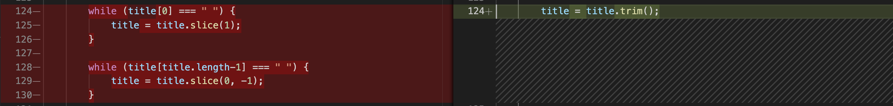

# Projet 8 - Reprenez et améliorez un projet existant

Cet avant-dernier projet de la formation "Développeur Front End" consite à reprendre un projet existant. 


## Pré-requis

```
npm install
```

## Démarrer le projet

```
npm start
```

L'application devrait s'ouvrir automatiquement dans le navigateur. 
Sinon, elle devrait être accssible à l'adresse http://localhost:8080

## Etape 1 : Corrigez les bugs

Plusieurs erreurs s'étaient insérées dans le code et ont été corrigées.

1. Erreur de typographie dans **controller.js**

**Ligne 95** du fichier **controller.js**: la fonction Controller.prototype.addItem comportait un "d" en trop. 


2. Absence d'un id unique dans **store.js**

La **fonction save** générait un nouvel id sous forme d'une suite de chiffres. Cette génération d'id n'était pas assez unique. 

Une librairie a été utilisée afin de générer un **UUID** (Universally Unique Identifer).

Plusieurs modifications ont été faites pour fixer ce bug.

* Suppression du code générant l'id

Suppression des **lignes 83 à 90** dans **store.js**


* Ajout du script de la librairie UUIDV4

Dans **index.html** ajout du **script**


* Ajout de la fonction générant l'id

Dans **store.js** ajout de la fonction permettant de générer un uuid


* Suppression des parseInt

Suppression de la **ligne 55** dans **models.js**, de la **ligne 138** dans **view.js** et de la **ligne 107** dans **store.js**


3. Erreur 404

Une erreur 404 était générée dans la console. 
La **ligne 48** dans **index.html** a été supprimée


4. Bug click toggle-all

Le click sur le "toggle-all" ne fonctionnait pas car le **label for** ne renvoyait à aucun **id**. 
Correction des **lignes 17 à 19** dans **index.html**


5. Refactorisation

        Méthode trim() 

Dans la **fonction title**, refactorisation avec la **méthode trim()** à la ligne **124** de **controller.js**



        Suppression forEach()

La boucle qui avait été créée, à la **ligne 159** de **controller.js** ne faisait qu'alourdir le code. L'insertion d'un **console.log()** permet de faire la même chose. 


        Suppression de l'assignation de la taille d'un tableau à une variable

Cela ne sert à rien d'assigner la taille d'un tableau à une variable. Le code a donc été refactorisé. Les **lignes 61 et 64** de **template.js** ont été corrigées.; 


        Insertion de Object.assign

Refactorisation des **lignes 87 à 89** de **store.js** en insérant **Object.assign** afin d'insérer toutes les propriétés dans un seul objet.


        Méthode filter()

Dans **Store.prototype.remove**, refactorisation avec la **méthode filter()** à la **ligne 118** dans **store.js**


## Etape 2: où sont les tests ?!

Plusieurs tests ont été réalisés et se retrouvent dans **ControllerSpec.js**

**9** tests **effectués** et **1** qui n'a **pas** été **demandé** mais qui pourrait être effectué.

1. **Pour exécuter les tests**

```
npm test
```

La page de test devrait s'ouvrir automatiquement. 
Sinon, elle devrait être accessible à l'adresse http://localhost:8081/test/SpecRunner.html

2. **Un Test beforeEach - ligne 62**

        Test de la fonction beforeEach


3. **Cinq Tests describe('routing') - ligne 92 et suivantes**

        3.1 Test de la fonction describe('routing') pour toutes les entrées actives


        3.2 Test de la fonction describe('routing') pour toutes les entrées complétées


        3.3 Test de la fonction describe('routing') pour tous les filtres par défaut


        3.4 Test de la fonction describe('routing') pour les filtres actifs


        3.5 Test manquant de la **fonction describe('routing') pour les filtres complétés


4. **Deux Tests pour describe('toggle_all') - lignes 178 et suivantes**

        1. Test de la fonction describe('toggle all') pour tous les todos complétés


        2. Test de la fonction describe('toggle all') pour la mise à jour


5. **Un Test pour describe('new todo') - ligne 219**

        Test de la fonction describe('new todo') pour ajouter un nouveau todo


6. **Un Test pour describe('element removal') - ligne 269**

        Test de la fonction describe('element removal') pour modifier une entrée


## Etape 3: optimisez la performance

Un **audit de performance** a été effectué tout en **scalant** par rapport au [site concurrent](http://todolistme.net/). 

>Voir [l'audit de performance](./docs/images/auditPerformance.pdf)


## Etape 4: améliorez le projet 

Plusieurs documentations sont demandés afin d'améliorer le projet: 

>Voir [la documentation utilisateur](./docs/images/manuel_utilisation.pdf)

>Voir [la documentation technique](https://juliemolla.github.io/P8_OC_todo/jsdoc/app.html)

**Pour générer la documentation technique ou la mettre à jour:**
```
npm run doc
```